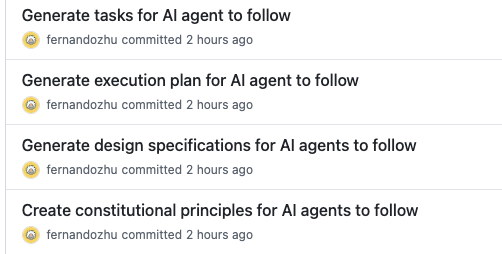
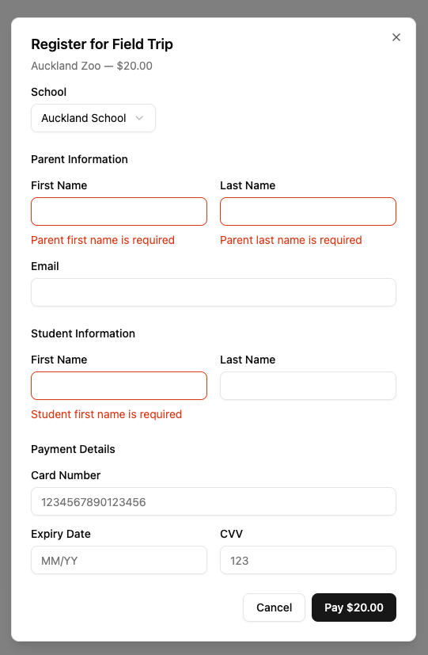

# School Payments

## Run the Project

### Pre-requisites

Assume the followings have been installed:

- Python3
- Node.js

### Run Backend Code

- Navigate to `school-payments/backend` folder
- Install dependencies by running: `pip install -r requirements`
- Run migration by executing: `python manage.py migrate`
- Load mock data by executing: `python manage.py loaddata mockdata.json`
- Run the project by executing: `python manager.py runserver`

- Navigate to `school-payments/backend` folder

### Run Frontend Code

- Navigate to `school-payments/frontend` folder
- Install dependencies by running: `npm i`
- Run the project by executing: `npm run dev`
- Open [http://localhost:5173/](http://localhost:5173/) and view the web page

## Unit Tests

Commands to run unit tests:

```bash
# Backend
cd school-payments/backend
python manage.py test

# Frontend
cd school-payments/frontend
npm run test
```

## High-level Architecture

### Backend

**Stack:** Python, Django 4.2, Django REST Framework 3.16, SQLite

#### Data Model

| Model                 | Key Fields                                                      |
| --------------------- | --------------------------------------------------------------- |
| School                | `id` (UUID), `name`                                             |
| Parent                | `first_name`, `last_name`, `email`                              |
| Student               | `first_name`, `last_name`, FK `parent`, FK `school`             |
| FieldTrip             | `id` (UUID), `location`, `cost`, `date`                         |
| FieldTripRegistration | FK `field_trip`, FK `student`                                   |
| Transaction           | `id`, `date`, `amount`, FK `student`, FK `activity` (FieldTrip) |

#### API Endpoints

| Method | URL              | Description                                                                                     |
| ------ | ---------------- | ----------------------------------------------------------------------------------------------- |
| GET    | `/api/fieldtrip` | List all field trips with available schools                                                     |
| POST   | `/api/payment`   | Validate payment, create parent/student, register for trip, process payment, create transaction |

#### Payment Processing

- `LegacyPaymentProcessor` simulates an external payment gateway
- 1.5s processing delay, 10% simulated failure rate
- On success: creates `Transaction` and `FieldTripRegistration` records

#### Validation (Serializer)

- `card_number`: exactly 16 digits
- `cvv`: exactly 3 digits
- `expiry_date`: MM/YY format (regex)

---

### Frontend

**Stack:** React 19, TypeScript 5.9, Vite 7, TailwindCSS v4, shadcn/ui, Radix UI, lucide-react

#### Project Structure

```
src/
├── config.ts              # API endpoint URLs from env
├── types/index.ts         # Shared TypeScript interfaces
├── lib/
│   ├── utils.ts           # cn() classname utility
│   └── validation.ts      # Field-level and form-level validation
├── services/
│   └── api.ts             # fetchFieldTrips(), submitPayment()
├── components/
│   ├── FieldTripCard.tsx   # Displays trip details + Register button
│   ├── RegistrationModal.tsx # Form: school, parent, student, payment info
│   ├── PaymentResult.tsx   # Success/failure display
│   └── ui/                # shadcn/ui primitives (button, card, dialog, input, label, select)
└── App.tsx                # Page state machine (loading → success/error), orchestrates components
```

## Leverage of AI

The `backend` project was mainly hand-written.

The `frontend` project leveraged AI agent (Claude Code) and followed Spec-Driven Development using [spec-kit](https://github.com/github/spec-kit). Detailed steps have been broken down into separate commits, as shown in screenshot below:



## UI Screens




